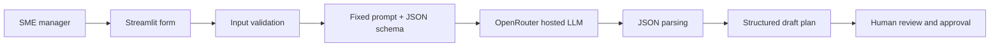

# PE6201 Individual Project

## Enterprise AI Pilot Planning Assistant

A Streamlit web form turns a low-risk SME use case into a structured, human-reviewable AI pilot plan. The form and fixed system prompt require a named test group, dated stages, a measurable target with a baseline, a feedback instrument, and a human approval gate. The system creates a draft; it never authorises a pilot or replaces business judgment.

**Live demo:** [https://pe6201-ai-pilot-planner.streamlit.app/](https://pe6201-ai-pilot-planner.streamlit.app/)

**Repository status:** public, reproducible prototype. The code, synthetic data, evaluation procedure, raw outputs, final adjudicated scores, and product documentation are checked in.

## Submission map

| Requirement | Evidence |
|---|---|
| Public interactive demo | [Open the Streamlit app](https://pe6201-ai-pilot-planner.streamlit.app/) |
| Original problem statement | [`docs/PE6201_Enterprise_AI_Pilot_Planning_Assistant.pdf`](docs/PE6201_Enterprise_AI_Pilot_Planning_Assistant.pdf) |
| Product documentation | [`docs/product_documentation.md`](docs/product_documentation.md) |
| Runnable code | [`app.py`](app.py), [`pilot_planner/`](pilot_planner/) |
| Data and data explainer | [`data/evaluation_cases.csv`](data/evaluation_cases.csv), [`data/README.md`](data/README.md) |
| Evaluation code and explainer | [`scripts/evaluate.py`](scripts/evaluate.py), [`evals/README.md`](evals/README.md), [`evals/rubric.md`](evals/rubric.md) |
| Transparent evaluation evidence | [`results/evaluation_results.json`](results/evaluation_results.json), [`results/final_scores.csv`](results/final_scores.csv), [`results/PE6201_Evaluation_Results.xlsx`](results/PE6201_Evaluation_Results.xlsx) |

## Reviewer quick start

### 1. Requirements

- Python 3.10 or newer
- Internet access for model calls
- An OpenRouter API key for live generation only

### 2. Install and run

macOS/Linux:

```bash
git clone https://github.com/by111111/PE6201-individual-project.git
cd PE6201-individual-project
python3 -m venv .venv
source .venv/bin/activate
pip install -r requirements.txt
export OPENROUTER_API_KEY='your-key'
export OPENROUTER_MODEL='openai/gpt-4.1-mini'  # optional; experiment model
streamlit run app.py
```

Windows PowerShell uses `.venv\Scripts\Activate.ps1` and `$env:OPENROUTER_API_KEY='your-key'`. The app opens at `http://localhost:8501`. Use only fictional or non-confidential inputs. Never commit a real key; `.env` and Streamlit secrets are ignored.

### 3. Inspect or reproduce the evaluation

The committed artifacts are enough to audit the completed experiment without spending money. To repeat the 40 API calls (20 generations plus 20 automated scoring calls):

```bash
python -m scripts.evaluate \
  --input data/evaluation_cases.csv \
  --output results/evaluation_results.json
```

Model outputs are stochastic and prices can change, so a rerun need not exactly match the checked-in results. Follow the manual adjudication procedure in [`evals/README.md`](evals/README.md) before replacing `final_scores.csv` or the workbook.

## Product architecture



The detailed Persona, Input, Output, external-intelligence boundary, evaluation path, and design trade-offs are in [`docs/product_documentation.md`](docs/product_documentation.md).

## Metrics: target versus result

| Metric | Target | Reached |
|---|---:|---:|
| Structured plan component score | at least 4.0/5 | **5.0/5** |
| Improvement over raw-model baseline | at least 1.0 point | **+1.9 points** |
| Structured output generation cost | monitor, no hard threshold | **US$0.0085 / 10 outputs** |
| Structured mean generation latency | monitor, no hard threshold | **5.5 seconds** |

The same ten cases and model were used in both conditions. The manually adjudicated raw baseline was 3.1/5. These results demonstrate explicit component coverage only—not factual correctness, user value, safety in every context, or business impact.

## Repository structure

```text
.
├── app.py                         # Streamlit interface and presentation layer
├── pilot_planner/                 # validation, prompt construction, provider, parsing
├── scripts/evaluate.py            # two-condition experiment runner
├── data/                          # frozen synthetic cases and provenance
├── evals/                         # protocol and binary scoring rubric
├── results/                       # raw evidence, scan-friendly scores, workbook
└── docs/                          # product documentation and problem statement
```

## Scope and safety boundary

The MVP follows one path: one low-risk scenario → one hosted-model call → one structured draft → human decision. It deliberately excludes accounts, persistent form storage, RAG, document upload, agents, and automated rollout. Do not enter personal data, client names, financial information, credentials, contracts, or confidential strategy. Do not use the system for health, credit, hiring, legal, security, or other high-stakes decisions.
