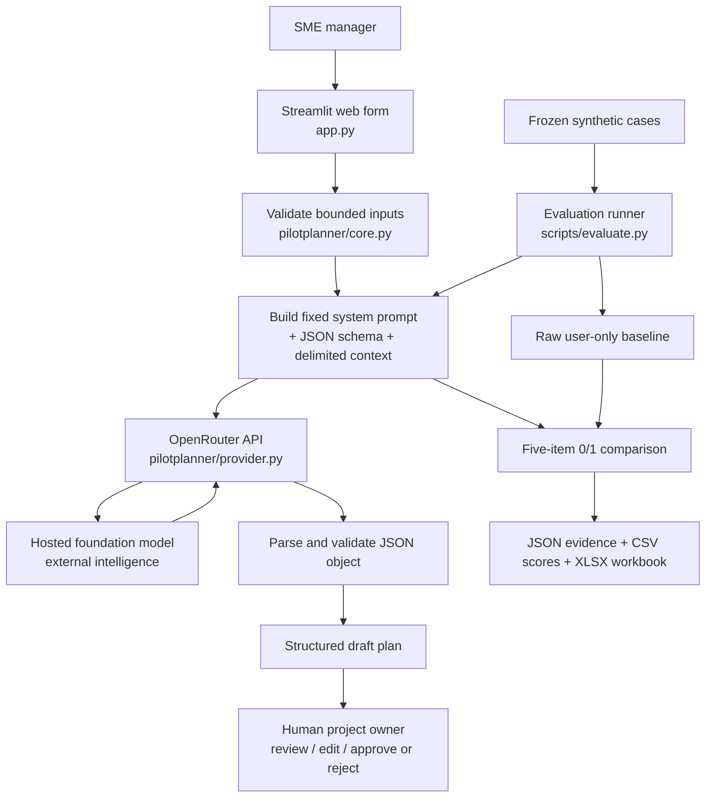

# Product Documentation

## Product in one sentence

The Enterprise AI Pilot Planning Assistant converts a bounded, low-risk SME scenario into a structured first-draft pilot plan that a human project owner must review and approve.

## Persona and job to be done

**Primary persona:** an SME manager or project owner who understands the business problem but does not have a dedicated AI product or evaluation team.

**Job to be done:** “Help me turn a possible AI use case into an operational pilot proposal that I can critique with colleagues before we commit resources or expose real data.”

**Excluded users and decisions:** the product is not designed for health, credit, hiring, legal, security, or other high-stakes decisions. It does not approve deployment.

## Inputs

| Input | Purpose | Validation / boundary |
|---|---|---|
| Industry/company type | situates the plan | required free text; fictional/non-confidential |
| AI use case | defines the task to test | required; low-risk assistance only |
| Participant role and number | makes the test group explicit | required |
| Duration in weeks | bounds the schedule | integer from 1 to 12 |
| Current pain point | explains why a pilot matters | required |
| Constraint | surfaces privacy/operational limits | required |
| Start date | anchors dated stages | required ISO date |

The app does not intentionally persist form submissions. Users are warned not to enter personal data, client names, credentials, financial details, contracts, or confidential strategy.

## Outputs

The hosted model must return a JSON object with:

1. objective;
2. named test group;
3. dated stages with task and owner;
4. numeric success target plus baseline/comparison;
5. feedback instrument specifying who or when;
6. risks and mitigations; and
7. human approval checkpoint before implementation.

The interface presents the object as a readable plan plus a technical record containing model and estimated cost. Invalid or non-object JSON is rejected. Every result is labelled as a draft.

## High-level architecture

### Component responsibilities

- `app.py`: presentation, form collection, safety messages, and rendering.
- `pilotplanner/core.py`: input rules, structured prompt, raw baseline prompt, and rubric prompt.
- `pilotplanner/provider.py`: external API call, timing/usage capture, and JSON parsing.
- `scripts/evaluate.py`: controlled two-condition evaluation and evidence persistence.
- `data/`: frozen test inputs and provenance.
- `evals/`: evaluation protocol and scoring rules.
- `results/`: raw outputs, initial model-judge evidence, final scores, and workbook.

## Product logic and external intelligence

Deterministic code validates inputs, calculates the pilot end date, constructs prompts, calls the provider, and parses the response. The hosted LLM supplies generative intelligence: it proposes objectives, stages, metrics, feedback, and mitigations. The LLM is not trusted to authorise action. Human review is a mandatory downstream control, not another generated field that can safely be ignored.

## Metrics targeted and reached

| Measure | Target | Reached | Interpretation |
|---|---:|---:|---|
| Mean structured component score | ≥4.0/5 | **5.0/5** | target met on ten synthetic cases |
| Mean improvement over raw baseline | ≥1.0 point | **+1.9** | target met; raw mean was 3.1/5 |
| Test-group pass rate | monitored | **100% vs 100%** | structure did not add value on this easy component |
| Dated-stage pass rate | monitored | **100% vs 100%** | raw model already handled this component |
| Metric pass rate | monitored | **100% vs 40%** | largest practical gain with feedback/gate |
| Feedback-instrument pass rate | monitored | **100% vs 40%** | raw answers were often vague |
| Human-checkpoint pass rate | monitored | **100% vs 30%** | strongest governance gap in raw answers |
| Structured generation cost | monitor | **US$0.0085 / 10** | about US$0.0009 per output in this run |
| Structured mean latency | monitor | **5.5 s** | observed, not a predeclared success threshold |

These metrics measure explicit coverage, not truth, feasibility, safety, user satisfaction, or realised business value.

## Scope, rough edges, and future path

The MVP intentionally has no authentication, database, document upload, RAG, multi-agent workflow, export, retry/backoff policy, or automated rollout. It has not undergone accessibility or real-user testing. A complete-looking plan can still be unsuitable, and delimiters cannot eliminate prompt injection.

The next evidence milestone is a usability study with SME managers and two independent plan reviewers. Suggested measures are time to first usable draft, edit distance, perceived usefulness, critical-error rate, inter-rater agreement, and stability across repeated runs/models. Product expansion should depend on that evidence.
